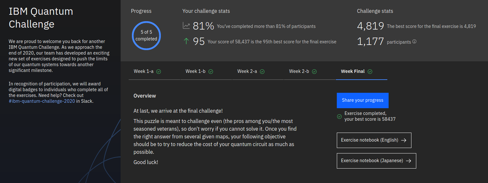

# IBMQuantumChallenge2020

[Original Challenge Repository](https://github.com/qiskit-community/IBMQuantumChallenge2020)

## Solution Write-Up
| Week  | Challenge | 
| Week 1 |[Learning Challenge Exercise I-A](https://github.com/qiskit-community/IBMQuantumChallenge2020/blob/iqx/exercises/week-1/ex_1a_en.ipynb)  [Learning Challenge Exercise I-B](https://github.com/qiskit-community/IBMQuantumChallenge2020/blob/iqx/exercises/week-1/ex_1b_en.ipynb)| 
| Week 2  |[Learning Challenge Exercise II-A](https://github.com/qiskit-community/IBMQuantumChallenge2020/blob/main/exercises/week-2/ex_2a_en.ipynb)  [Learning Challenge Exercise II-B](https://github.com/qiskit-community/IBMQuantumChallenge2020/blob/main/exercises/week-2/ex_2b_en.ipynb)| [Episode 3](https://youtu.be/kLizHnvTguE), 
| Week 3  |[Final Challenge](https://github.com/qiskit-community/IBMQuantumChallenge2020/blob/main/exercises/week-3/final_en.ipynb) | 
  
